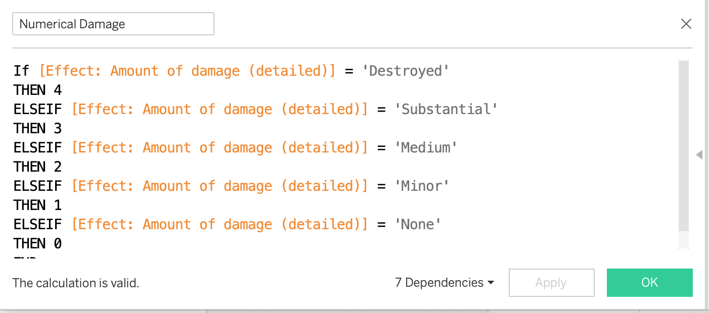

# Final-Project-Tableau
**Option 2: FAA Wildlife Strikes**
dataset: [faa_data_subset.xlsx](References/faa_data_subset.xlsx)
The dataset is the collection of reports of Wildlife Air Traffic strikes across the United States from 2000 to 2015. To carry out this assignment, I made use of the trial version of Tableau Desktop. 

## Project/Goals
The objective of this project was to exercise and demonstrate the skills learned from Lighthouse Labs week 4, during which we were introduced to Tableau as a tool for data analysis by visualization. 
My purpose was to connect and load the data, analyze the parameters and variables, and develop visualizations to explore the relationships and discover key details. 

## Process
### 1. Connecting the Data
Before connecting the data to Tableau, I downloaded the .csv file and viewed it in Excel. I used Data Filters to get an idea of the number of records, and the quantity of null values and duplicates. I then connected the Data to Tableau using the 'Add Excel sheet' and used 'Data Interpreter' to preliminary clean the data. [See attached](References/Marked.faa_data_subset.2125495777790730.xlsx). 
### 2. EDA and Data Cleaning Key Highlights: 
- updated the Airport Code to a Geographical Region to enable mapping. 
- managed 232 NULL values in the `When: Time of Day`, by using  `DATEPART` function on the `Collision Date Time` field to create a Calculated Field called `Time of Day`.

- created a `Cost: not Downtime` field.
- numerically encoded `Effect: Amount of Damage (detailed)` in order to use it for statistical analysis.

- created hierarchies for `Location`, `Wildlife` and `Damage`.

### 2. Visualization
To study the data, understand its information, identify any patterns, trends, and investiage outliers. 
Techniques used included:
1. Use of the Parameter technique to develop dynamic dimensions and measures for several bar graphs, summarizing the relationships between dimensions like wildlife categories and types of aircraft, and measures like the frequency of strikes, impact and cost.
2. Developed timelines for the frequency of strikes, cost and impact, and used Analysis Forecasting to project across the next 4 years (2016-2019).
3. Created state-based visualization to analyze the impact of wildlife strikes on each state in terms of cost, frequency, likelihood of animal species, etc. 

## Results

**Option 2: FAA Wildlife Strikes**
dataset: [faa_data_subset.xlsx](References/faa_data_subset.xlsx)

### What states in the USA are most frequently impacted by wildlife strikes? What states are taxed the most i.e. the total costs?

As shown, *California*, *New York* and *Texas* are the hardest hit in terms of cost and frequency.

### What wildlife category and species are the most frequently encountered, and cost the most damage?

95.73% of wildlife attacks are birds, followed by terrestial mammals (2.98%), Bats (1.17%) and Reptiles (0.12%)

### Trends
1. What is the trend of wildlife strikes during this period in terms of frequency, impact of damage and the total cost including cost of forced downtime?
2. Did I observe any significant outlier in the trend and possible cause?
3. Can future trends be forecasted?

- There is a **July - November peak period**  for wildlife strikes, primarily birds. THis can be explained by migration patterns.
- Spike in cost in **January 2009**. Probaby due to the highly publicized Hudson River landing, which led to increased government regulation and funding into the incidents of wildlife strikes.
- The frequency of wildlife strikes is **forecasted** to increase over the years. This is probably the result of the wildlife population becoming increasingly comfortable with urban areas, and the development of quieter 2-engine aircrafts, which reduces the ability of these animals to detect these aircrafts. 
- However, the impact and cost of these strikes will reduce, due to use of protective measures like more awareness of bird migration patterns, the development of better radar technology, and more durable aircraft. 
- It should be noted that despite the risk involved, the majority of Wildlife Strikes result in no damage or cost. 

### What periods in flight phase are most likely to encounter wildlife strikes?

### What aircraft types and/or engine configuration are most likely to be hit by wildlife?

### More results:
1. What airports have the greatest number of recorded wildlife strikes? *Dallas International, Texas*
2. What airports have the highest cost impact? *La Guardia, New York*
3. What time of day are certain species more likely to attack? *Birds and reptiles predominantly attack during the day, while bats and mammals generally attack at night time.*

The visualizations for these findings can be seen in the Dashboards of [Wildlife Project Tableaux book](Wildlife%20Project.twb)

## Challenges 
- I started my project using Tableau Public and I faced many challenges with saving my data and accessing it for previews and updates. I eventually switched to the trial version of Tableau Desktop. 
- It was difficult to develop the Forecast because the Time period had to be in discrete dimensions. I generally faced challenges in distinguishing between the proper use of dimensions and measures. 
- It was difficult to develop the Dashboard in a way that was both aesthetically appealing and communicated the relevant information. 

## Future Goals
If given the opportunity to work more on this project, I would like to: 
- Download, if available, the current report on FAA Strikes and compare the forecast of 2015-2018 frequency, cost and impact against actual records.
- Get statistics on the frequence of flight throughout this period to determine the overall probability of a wildlife strike in general commercial flight, and develop models to predict its occurences and potential consequences. 