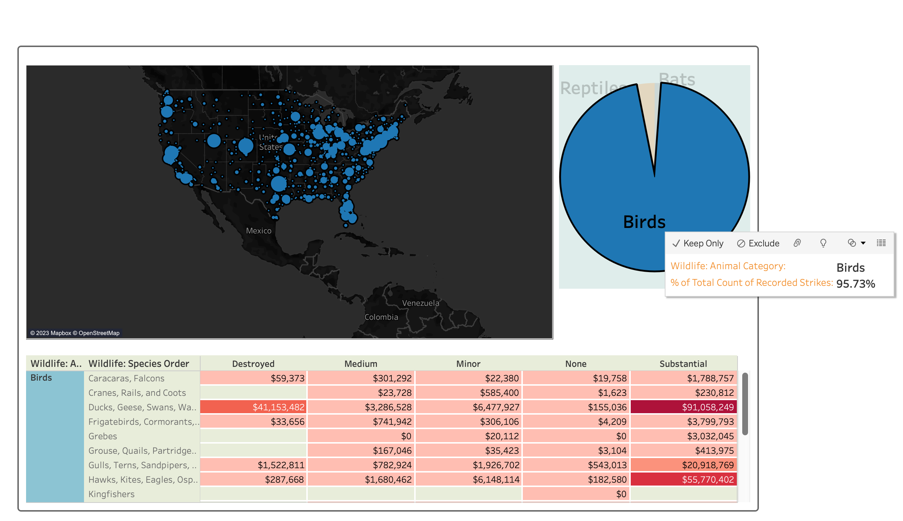
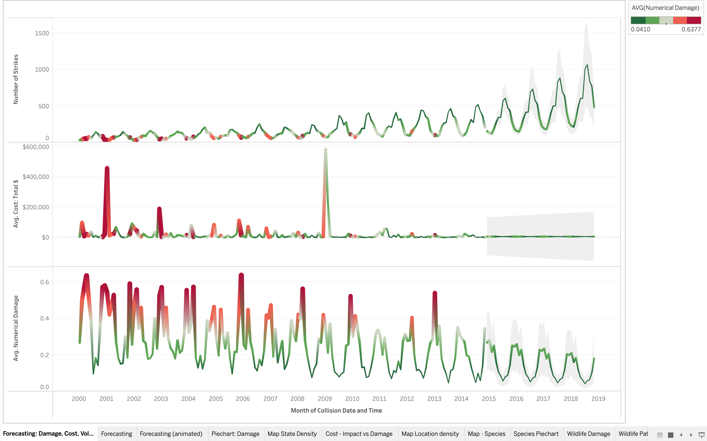
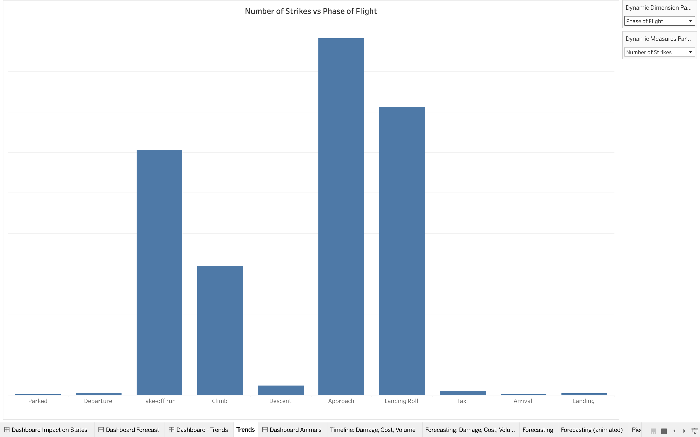
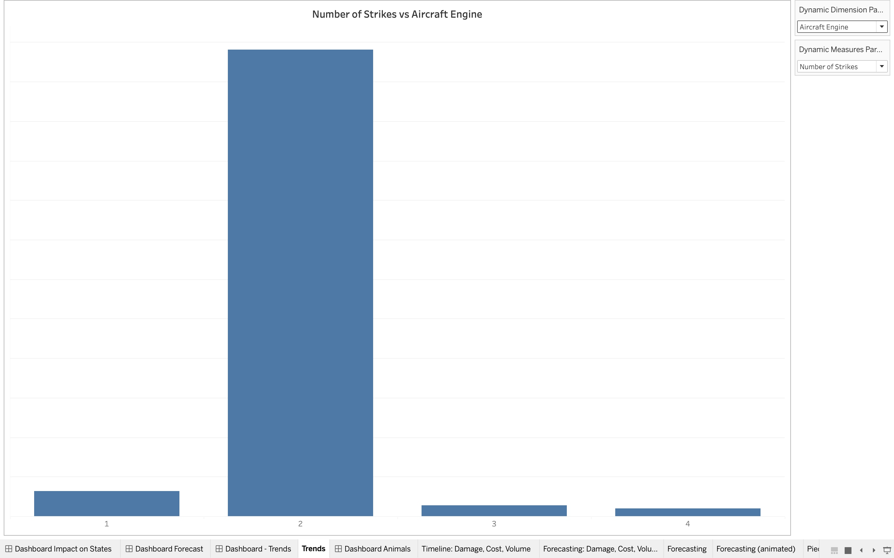

# Final-Project-Tableau
**Option 2: FAA Wildlife Strikes**
dataset: [faa_data_subset.xlsx](References/faa_data_subset.xlsx)

## Project/Goals
The objective of this project was to exercise and demonstrate the skills learned from Lighthouse Labs week 4, during which we were introduced to Tableau as a tool for data analysis by visualization. 
The dataset is the collection of reports of Wildlife Air Traffic strikes across the United States from 2000 to 2015. To carry out this assignment, I made use of the trial version of Tableau Desktop. My purpose was to connect and load the data, analyze the parameters and variables, and develop visualizations to explore the relationships and discover key details. 

## Process
### 1. Connecting the Data
Before connecting the data to Tableau, I downloaded the .csv file and viewed it in Excel. I used Data Filters to get an idea of the number of records, and the quantity of null values and duplicates. I then connected the Data to Tableau using the 'Add Excel sheet' and used 'Data Interpreter' to preliminary clean the data. [See attached](References/Marked.faa_data_subset.2125495777790730.xlsx). 
### 2. EDA and Data Cleaning: 
- updated the Airport Code to Geographical Region. 
- observed 232 NULL values in the `When: Time of Day`, and used  `DATEPART` function on the `Collision Date Time` field to create a Calculated Field called `Time of Day` that found 231 out of the 232 missing values.
- created a `Cost: not Downtime` field.
- numerically encoded `Effect: Amount of Damage (detailed)` in order to use it for statistical analysis.
- created hierarchies for `Location`, `Wildlife` and `Damage`.

### 2. Visualization
Techniques used for visualization included:
    Used the Parameter technique to develop dynamic dimensions and measures for several bar graphs, summarizing the relationships between dimensions like wildlife categories and types of aircraft, and measures like the frequency of strikes, impact and cost.
    Developed timelines for the frequency of strikes, cost and impact, and used Analysis Forecasting to project across the next 4 years (2016-2019).
    Created state-based visualization to analyze the impact of wildlife strikes on each state.

## Results

**Option 2: FAA Wildlife Strikes**
dataset: [faa_data_subset.xlsx](References/faa_data_subset.xlsx)

### What states in the USA are most frequently impacted by wildlife strikes? What states are taxed the most i.e. the total costs?

### What wildlife category and species are the most frequently encountered, and cost the most damage?

### Trends
    - What is the trend of wildlife strikes during this period in terms of frequency, impact of damage and the total cost including cost of forced downtime?
    - Did you notice any significant outlier in the trend and possible cause?
    - Can future trends be forecasted?

**Summary**: 
- July - November peak period for wildlife strikes, primarily birds. Coincides with migration patterns.
- Spike in cost in January 2009. Probaby due to the highly publicized Hudson River landing, which led to increased government regulation and funding into the incidents of wildlife strikes.
- The frequency of wildlife strikes is forecasted to increase over the years. This is probably the result of the bird population becoming increasingly comfortable with urban areas, and the development of quieter 2-engine aircrafts, which reduces the likelihood of wildlife detecting an engine until it's too late. 
- However, the impact and cost of these strikes will reduce, due to use of protective measures like more awareness of bird migration patterns, the development of better radar technology, more durable aircraft. 

### What periods in flight phase are most likely to encounter wildlife strikes?

### What aircraft types and/or engine configuration are most likely to be hit by wildlife?

### More results:
1. What airports have the greatest number of recorded wildlife strikes?
2. What airports have the highest cost?
3. Which animal species are the most impactful in each category?

## Challenges 
- Using Tableau Public. I faced challenges saving my data and accessing it for previewing and updates, so I eventually switched to Tableau Desktop for greater flexibility.
- Steep learning curve, understanding when to use Measures and Dimensions.
- Developing the Dashboard in a way that was both aesthetically appealing and could communicate the relevant information.

## Future Goals
- Check modelling accuracy by downloading, if available, the current report on FAA Strikes and compare the forecasted data about frequency, cost and impact in the periods of 2015-2018 against actual records.
- Get statistics on the frequence of flight throughout this period to determine the overall probability of a wildlife strike, and its consequences. 

